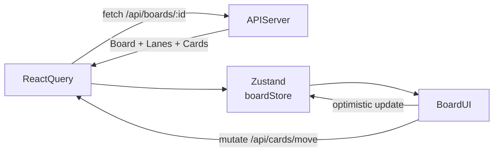

# BoardFlow — Fullstack Kanban Board: Detailed Architecture Plan

## Tech Stack Decisions

- **Frontend**: Next.js 14 App Router (TypeScript, Tailwind CSS, shadcn/ui)
- **State**: Zustand (local/optimistic UI) + React Query (server state)
- **Drag & Drop**: `dnd-kit` (modern, accessible, works well with React 18)
- **Backend**: Express.js (standalone API, not Next.js API routes — cleaner separation)
- **Database**: PostgreSQL + Prisma ORM
- **Auth**: JWT (access + refresh tokens) — no external auth services
- **Validation**: Zod (shared between frontend and backend)
- **Real-time**: Socket.io (stretch goal #1)
- **Tests**: Vitest (unit/integration) + Supertest (API tests)
- **Docker**: Docker Compose with `web` (Next.js), `api` (Express), `db` (Postgres)

---

## Monorepo Structure

```
kanban-board/
├── docker-compose.yml
├── .env.example
├── apps/
│   ├── web/                    # Next.js frontend
│   │   ├── Dockerfile
│   │   ├── src/
│   │   │   ├── app/            # App Router pages
│   │   │   │   ├── (auth)/     # login, register
│   │   │   │   ├── board/[id]/ # Kanban board page
│   │   │   │   └── layout.tsx
│   │   │   ├── features/
│   │   │   │   ├── auth/       # login form, hooks, api calls
│   │   │   │   ├── board/      # Board, Lane, Card components + hooks
│   │   │   │   └── settings/   # Dark mode, settings panel
│   │   │   ├── components/ui/  # shadcn/ui primitives
│   │   │   ├── lib/
│   │   │   │   ├── api.ts      # Axios/fetch wrapper
│   │   │   │   └── queryClient.ts
│   │   │   └── stores/         # Zustand stores
│   └── api/                    # Express backend
│       ├── Dockerfile
│       ├── src/
│       │   ├── modules/
│       │   │   ├── auth/       # controller, service, routes
│       │   │   ├── board/
│       │   │   ├── lane/
│       │   │   └── card/
│       │   ├── middleware/
│       │   │   ├── auth.ts     # JWT guard
│       │   │   ├── error.ts    # centralized error handler
│       │   │   └── validate.ts # Zod validation middleware
│       │   ├── prisma/
│       │   │   └── client.ts   # singleton Prisma client
│       │   └── index.ts
│       └── tests/
│           ├── auth.test.ts
│           ├── board.test.ts
│           ├── lane.test.ts
│           └── card.test.ts
└── packages/
    └── shared/                 # Shared Zod schemas + TypeScript types
        ├── schemas/
        │   ├── auth.ts
        │   ├── board.ts
        │   ├── lane.ts
        │   └── card.ts
        └── index.ts
```

---

## Database Schema (Prisma)

```prisma
model User {
  id           String   @id @default(uuid())
  email        String   @unique
  passwordHash String
  tenantId     String   @default(uuid())
  boards       Board[]
  createdAt    DateTime @default(now())
}

model Board {
  id        String   @id @default(uuid())
  title     String
  tenantId  String
  ownerId   String
  owner     User     @relation(fields: [ownerId], references: [id])
  lanes     Lane[]
  createdAt DateTime @default(now())

  @@index([tenantId])
}

model Lane {
  id        String @id @default(uuid())
  title     String
  position  Int    // for ordering
  isDefault Boolean @default(false)  // default lanes cannot be deleted
  boardId   String
  board     Board  @relation(fields: [boardId], references: [id], onDelete: Cascade)
  cards     Card[]
  tenantId  String

  @@index([boardId])
  @@index([tenantId])
}

model Card {
  id          String   @id @default(uuid())
  title       String
  description String?  // Markdown content (stretch #2)
  position    Int      // for ordering within a lane
  laneId      String
  lane        Lane     @relation(fields: [laneId], references: [id], onDelete: Cascade)
  tenantId    String
  createdAt   DateTime @default(now())
  updatedAt   DateTime @updatedAt

  @@index([laneId])
  @@index([tenantId])
}
```

Key design decisions:
- `tenantId` on every model — scoped at the `User` level (user IS the tenant in single-user mode; shared in collaboration)
- `position` integer on `Lane` and `Card` for drag-and-drop ordering (fractional indexing on reorder)
- Cascade deletes: deleting a Board cascades → Lanes → Cards

---

## API Design

### Auth Module — `POST /api/auth/register`, `POST /api/auth/login`, `POST /api/auth/refresh`

- Passwords hashed with `bcryptjs`
- Returns `accessToken` (15min) + `refreshToken` (7d, httpOnly cookie)
- `tenantId` embedded in JWT payload

### Board Module — `GET/POST /api/boards`, `GET/PATCH/DELETE /api/boards/:id`

- All queries filter by `tenantId` from JWT

### Lane Module — `POST /api/boards/:boardId/lanes`, `PATCH/DELETE /api/lanes/:id`, `PATCH /api/lanes/reorder`

- Reorder endpoint accepts `[{ id, position }]` array — bulk update

### Card Module — `POST /api/lanes/:laneId/cards`, `PATCH/DELETE /api/cards/:id`, `PATCH /api/cards/move`

- Move endpoint: `{ cardId, toLaneId, position }` — handles cross-lane moves

### Controller → Service → Prisma pattern

```typescript
// card.controller.ts — HTTP only
async moveCard(req, res) {
  const dto = moveCardSchema.parse(req.body);
  const card = await cardService.move(req.user.tenantId, dto);
  res.json(card);
}

// card.service.ts — business logic
async move(tenantId: string, dto: MoveCardDto) {
  const card = await cardData.findByIdAndTenant(dto.cardId, tenantId);
  if (!card) throw new NotFoundError('Card not found');
  return cardData.move(dto);
}
```

---

## Frontend Architecture

### Data Flow



### Key Components

- `BoardPage` — server component, fetches initial board data
- `BoardClient` — client component, owns dnd-kit `DndContext`
- `LaneColumn` — `SortableContext` for cards within a lane
- `CardItem` — `useSortable` from dnd-kit
- `CardModal` — create/edit card with Markdown editor (stretch #2: `@uiw/react-md-editor`)

### Optimistic Drag & Drop

1. `onDragEnd` fires → immediately update Zustand store (instant UI)
2. Fire React Query mutation to `PATCH /api/cards/move`
3. On error → rollback Zustand to previous snapshot

---

## Shared Zod Schemas (`packages/shared`)

Single source of truth for validation — imported by both API (runtime validation) and frontend (form validation):

```typescript
// packages/shared/schemas/card.ts
export const moveCardSchema = z.object({
  cardId: z.string().uuid(),
  toLaneId: z.string().uuid(),
  position: z.number().int().min(0),
});

export const createCardSchema = z.object({
  title: z.string().min(1).max(200),
  description: z.string().optional(),
  laneId: z.string().uuid(),
});
```

---

## Testing Strategy

The goal is not just correctness — it's demonstrating that AI-generated code has been **audited**. AI commonly introduces these specific classes of bugs:

- Authorization bypasses (forgets `tenantId` filter on one endpoint)
- Off-by-one errors in position ordering after drag-and-drop
- Wrong HTTP status codes (200 vs 201, 403 vs 404)
- Missing cascade behavior (deleting a board leaves orphan cards)
- Input boundary failures (empty string passes `min(1)` if trimming is skipped)
- JWT edge cases handled inconsistently across routes
- Optimistic UI state not rolled back on server error

Every test category below targets one of these failure modes directly.

---

### Test Infrastructure

```
apps/api/
└── tests/
    ├── helpers/
    │   ├── setup.ts        # beforeAll: connect test DB, run migrations
    │   ├── teardown.ts     # afterAll: wipe test DB
    │   ├── factories.ts    # createUser(), createBoard(), createCard() helpers
    │   └── request.ts      # authenticated supertest wrapper
    ├── auth.test.ts
    ├── board.test.ts
    ├── lane.test.ts
    └── card.test.ts

apps/web/
└── src/__tests__/
    ├── stores/
    │   └── boardStore.test.ts
    ├── schemas/
    │   └── cardSchemas.test.ts
    └── components/
        └── CardModal.test.tsx
```

Tests use a real Postgres instance (`DATABASE_URL` points to a `kanban_test` database). Each test file runs `beforeEach` cleanup to ensure isolation — no mocks for the database layer, because mocks hide the exact bugs AI tends to introduce in Prisma queries.

---

### Category 1 — Authentication & Authorization (Security)

These tests exist specifically because AI often generates the happy path but skips token validation on edge cases.

```typescript
// auth.test.ts

describe('POST /api/auth/register', () => {
  it('rejects duplicate email with 409', ...);
  it('rejects empty email', ...);          // Zod boundary
  it('rejects password shorter than 8 chars', ...);
  it('stores a bcrypt hash, never plaintext', async () => {
    await register('user@test.com', 'password123');
    const row = await db.user.findUnique({ where: { email: 'user@test.com' } });
    expect(row!.passwordHash).not.toBe('password123');
    expect(row!.passwordHash).toMatch(/^\$2[ab]\$/);  // bcrypt prefix
  });
});

describe('POST /api/auth/login', () => {
  it('rejects wrong password with 401, not 500', ...);
  it('rejects non-existent email with 401 (not 404 — no user enumeration)', ...);
});

describe('Protected routes', () => {
  it('returns 401 with no Authorization header', ...);
  it('returns 401 with malformed token (not a JWT)', ...);
  it('returns 401 with expired access token', async () => {
    const expiredToken = signToken({ userId: user.id }, '0s');
    const res = await request(app)
      .get('/api/boards')
      .set('Authorization', `Bearer ${expiredToken}`);
    expect(res.status).toBe(401);
  });
  it('returns 401 with valid signature but wrong secret', ...);
});
```

---

### Category 2 — Tenant Isolation (Cross-Tenant Data Leakage)

This is the highest-risk failure in AI-generated multi-tenant code. AI often writes the correct filter on `GET /boards` but forgets it on `GET /boards/:id` or `PATCH /cards/:id`.

```typescript
// board.test.ts

describe('Tenant isolation', () => {
  let user1Token: string, user2Token: string;
  let user1BoardId: string;

  beforeEach(async () => {
    user1Token = await loginAs('user1@test.com');
    user2Token = await loginAs('user2@test.com');
    user1BoardId = await createBoardAs(user1Token, 'User1 Board');
  });

  it('GET /boards returns only own boards', async () => {
    const res = await authedGet(user2Token, '/api/boards');
    expect(res.body.map((b: Board) => b.id)).not.toContain(user1BoardId);
  });

  it('GET /boards/:id returns 403 for another tenant', async () => {
    const res = await authedGet(user2Token, `/api/boards/${user1BoardId}`);
    expect(res.status).toBe(403);
  });

  it('PATCH /boards/:id returns 403 for another tenant', ...);
  it('DELETE /boards/:id returns 403 for another tenant', ...);

  it('cannot read a card belonging to another tenant by guessing its UUID', async () => {
    const card = await createCardAs(user1Token, { laneId: user1LaneId, title: 'Secret' });
    const res = await authedGet(user2Token, `/api/cards/${card.id}`);
    expect(res.status).toBe(403);
  });
});
```

---

### Category 3 — Input Validation Boundaries (Zod Edge Cases)

AI-generated Zod schemas often have subtle gaps — these tests catch them.

```typescript
// card.test.ts

describe('Card validation', () => {
  it('rejects title as empty string', async () => {
    const res = await createCard({ title: '', laneId });
    expect(res.status).toBe(400);
  });

  it('rejects title as whitespace only', async () => {
    const res = await createCard({ title: '   ', laneId });
    expect(res.status).toBe(400);  // requires .trim().min(1) in schema
  });

  it('rejects title over 200 chars', async () => {
    const res = await createCard({ title: 'a'.repeat(201), laneId });
    expect(res.status).toBe(400);
  });

  it('rejects non-UUID laneId', async () => {
    const res = await createCard({ title: 'Valid', laneId: 'not-a-uuid' });
    expect(res.status).toBe(400);
  });

  it('rejects negative position in moveCard', async () => {
    const res = await moveCard({ cardId, toLaneId, position: -1 });
    expect(res.status).toBe(400);
  });

  it('rejects non-integer position (float)', async () => {
    const res = await moveCard({ cardId, toLaneId, position: 1.5 });
    expect(res.status).toBe(400);
  });
});
```

---

### Category 4 — Business Logic & State Consistency

These test that the **ordering system** (position integers) remains consistent after operations — the hardest thing for AI to get right.

```typescript
// card.test.ts

describe('Card positioning', () => {
  it('new cards appended with correct position', async () => {
    const c1 = await createCard({ title: 'A', laneId });
    const c2 = await createCard({ title: 'B', laneId });
    const c3 = await createCard({ title: 'C', laneId });
    expect(c1.position).toBeLessThan(c2.position);
    expect(c2.position).toBeLessThan(c3.position);
  });

  it('moving a card updates positions of displaced cards', async () => {
    // cards [A@0, B@1, C@2] — move C to position 0
    await moveCard({ cardId: cardC.id, toLaneId: laneId, position: 0 });
    const lane = await getLane(laneId);
    const positions = lane.cards.map((c) => c.position);
    expect(new Set(positions).size).toBe(positions.length); // no duplicates
  });

  it('cross-lane move removes card from source lane', async () => {
    await moveCard({ cardId: cardA.id, toLaneId: lane2Id, position: 0 });
    const lane1Cards = await getCards(lane1Id);
    expect(lane1Cards.map((c) => c.id)).not.toContain(cardA.id);
  });

  it('cannot move card to lane in a different board (403)', async () => {
    const res = await authedPatch(token, '/api/cards/move', {
      cardId: cardA.id,
      toLaneId: laneInOtherBoard.id,
      position: 0,
    });
    expect(res.status).toBe(403);
  });
});

// board.test.ts

describe('Cascade deletes', () => {
  it('deleting a board removes all its lanes and cards', async () => {
    await deleteBoard(boardId);
    const orphanLanes = await db.lane.findMany({ where: { boardId } });
    const orphanCards = await db.card.findMany({ where: { tenantId: user.tenantId } });
    expect(orphanLanes).toHaveLength(0);
    expect(orphanCards).toHaveLength(0);
  });
});
```

---

### Category 5 — Frontend: Zustand Store Correctness

These verify the optimistic update / rollback logic that AI often generates incompletely.

```typescript
// boardStore.test.ts

describe('optimistic card move', () => {
  it('immediately reflects new lane in UI state', () => {
    const { moveCardOptimistic } = useBoardStore.getState();
    moveCardOptimistic(cardId, fromLaneId, toLaneId, 0);
    const state = useBoardStore.getState();
    expect(state.lanes[toLaneId].cards).toContainEqual(
      expect.objectContaining({ id: cardId })
    );
    expect(state.lanes[fromLaneId].cards).not.toContainEqual(
      expect.objectContaining({ id: cardId })
    );
  });

  it('rolls back to previous state on server error', () => {
    const snapshot = useBoardStore.getState().snapshot();
    useBoardStore.getState().moveCardOptimistic(cardId, fromLaneId, toLaneId, 0);
    useBoardStore.getState().rollback(snapshot);
    const state = useBoardStore.getState();
    expect(state.lanes[fromLaneId].cards).toContainEqual(
      expect.objectContaining({ id: cardId })
    );
  });
});
```

---

### Category 6 — HTTP Contract Tests

AI often returns wrong status codes. These are fast, explicit contracts.

| Scenario | Expected Status |
|---|---|
| `POST /auth/register` success | 201 |
| `POST /auth/login` success | 200 |
| `GET /boards/:id` own board | 200 |
| `GET /boards/:id` other tenant | 403 |
| `GET /boards/:id` non-existent UUID | 404 |
| `POST /boards` missing title | 400 |
| `DELETE /boards/:id` success | 204 |
| `PATCH /cards/move` card not found | 404 |
| `PATCH /cards/move` cross-board lane | 403 |
| Any route, no token | 401 |
| Any route, expired token | 401 |

---

### Test Coverage Target

- **API**: aim for coverage of every route × (happy path + at least 2 failure cases)
- **Schemas**: every Zod schema field has a boundary test
- **Store**: optimistic path + rollback path
- **Skip**: DOM snapshot tests, CSS tests — these add noise without catching real bugs

Total test count target: ~45–60 tests across all files, completable in the 60-minute Milestone 6 window.

---

## Docker Compose

```yaml
services:
  db:
    image: postgres:16-alpine
    environment:
      POSTGRES_DB: kanban
      POSTGRES_USER: kanban
      POSTGRES_PASSWORD: kanban
    volumes:
      - postgres_data:/var/lib/postgresql/data
    healthcheck:
      test: ["CMD-SHELL", "pg_isready -U kanban"]
      interval: 5s
      retries: 5

  api:
    build: ./apps/api
    depends_on:
      db:
        condition: service_healthy
    environment:
      DATABASE_URL: postgresql://kanban:kanban@db:5432/kanban
      JWT_SECRET: supersecret
      JWT_REFRESH_SECRET: refreshsecret
    ports:
      - "4000:4000"
    command: sh -c "npx prisma migrate deploy && node dist/index.js"

  web:
    build: ./apps/web
    depends_on:
      - api
    environment:
      NEXT_PUBLIC_API_URL: http://localhost:4000
    ports:
      - "3000:3000"

volumes:
  postgres_data:
```

- `prisma migrate deploy` runs automatically on `api` startup — zero manual setup
- Health check on `db` ensures API doesn't start before Postgres is ready

---

## UI/UX Design System (Reference: NovaBoard)

The design reference establishes a clean, pastel-toned project management aesthetic. All implementation follows this visual language.

### Design Reference


---

### Color Palette — Tailwind Config Extensions

```typescript
// tailwind.config.ts — extend colors
colors: {
  sidebar:  { bg: '#d6ede2', icon: '#4a9e7f', active: '#f5c842' },
  lane: {
    todo:       { bg: '#fce8ed', dot: '#f06292' },
    inprogress: { bg: '#fff3e0', dot: '#fb8c00' },
    inreview:   { bg: '#e8f4fd', dot: '#42a5f5' },
    done:       { bg: '#ede7f6', dot: '#ab47bc' },
  },
  priority: {
    high:   { bg: '#fff3e0', text: '#fb8c00' },
    medium: { bg: '#e0f7f4', text: '#00897b' },
    low:    { bg: '#e8f4fd', text: '#1976d2' },
  },
  card:     { bg: '#ffffff', border: '#f0f0f0' },
  progress: { bar: '#00bfa5', track: '#e0e0e0' },
  cta:      '#f5c842',
  app:      { bg: '#f4f6f8' },
}
```

---

### Page Layout (Desktop + Mobile)

```
┌─────────────────────────────────────────────────────────┐
│ Sidebar (64px wide, icon-only, green bg)                 │
│  ├─ Logo (teal icon)                                     │
│  ├─ Dashboard icon                                       │
│  ├─ Board icon (active, yellow highlight)                │
│  ├─ Tasks icon                                           │
│  ├─ Team icon                                            │
│  └─ Calendar icon                                        │
├───────────────────────────────────────────────────────  │
│ Main area                                                │
│  ┌── Header ──────────────────────────────────────────┐ │
│  │  Board title  Client · Timeline · Status badge     │ │
│  │  [Share] [Settings] [Invite People]                │ │
│  └────────────────────────────────────────────────────┘ │
│  ┌── Tab Nav ─────────────────────────────────────────┐ │
│  │  Overview | List | [Board] | Calendar | Documents  │ │
│  └────────────────────────────────────────────────────┘ │
│  ┌── Toolbar ──────────────────────────────────────────┐ │
│  │  🔍 Search task   Sort by: Stage ▾   🔽 Filter     │ │
│  │                                    [+ Add New Card] │ │
│  └────────────────────────────────────────────────────┘ │
│  ┌── Board (horizontal scroll) ───────────────────────┐ │
│  │  [To Do col] [In Progress col] [In Review] [Done]  │ │
│  └────────────────────────────────────────────────────┘ │
└─────────────────────────────────────────────────────────┘
```

**Mobile (< 768px):**
- Sidebar collapses to a bottom tab bar (5 icons)
- Board columns stack vertically or horizontally scroll (one column visible at a time with peek of next)
- Card modal becomes a full-screen bottom sheet

---

### Component Breakdown

#### `AppSidebar`
- Fixed left, 64px wide on desktop, hidden on mobile
- Icon-only nav using shadcn/ui `Tooltip` for labels on hover
- Active state: yellow/gold circular background behind icon
- Bottom: Settings icon

#### `BoardHeader`
- Board title (24px bold), client name, date range, status badge (`In Progress` — teal pill)
- Right actions: Share button, Settings button, Invite People button with stacked avatars (+N overflow)

#### `BoardTabs`
- Horizontal pill tabs: Overview, List, Board (active — bold, underline indicator), Calendar, Documents, Messages
- Only "Board" view is implemented; others show a "Coming soon" placeholder

#### `BoardToolbar`
- Left: `SearchInput` with magnifier icon and `⌘S` shortcut hint
- Center: `SortDropdown` — "Sort by: Stage" with chevron
- Right: `FilterButton` + `AddCardButton` (gold background, `+ Add New`)

#### `LaneColumn`

Each lane is a vertically scrollable column with:
- **Header**: colored dot + lane title + card count badge + `⋯` menu (rename, delete)
- **Background**: pastel tinted (color determined by lane index or custom color stored in DB)
- **Footer**: `+ Add task` ghost button

```typescript
// Lane color assignment (cycles through palette)
const LANE_COLORS = ['todo', 'inprogress', 'inreview', 'done'] as const;
const laneColor = LANE_COLORS[laneIndex % LANE_COLORS.length];
```

#### `CardItem`

Full anatomy matching the reference:

```
┌─────────────────────────────────────┐
│  [Medium]  ← priority pill (teal)   │
│                                     │
│  Create Dashboard Wireframe         │  ← title (bold, 15px)
│  Note: Client wants more whitespace │  ← description (muted, 12px, 2 lines max)
│  in the left sidebar.               │
│                                     │
│  Progress ──────────────── 60%      │  ← progress bar (green)
│                                     │
│  [avatar][avatar]  📎3  💬5         │  ← meta row
└─────────────────────────────────────┘
```

Props: `title`, `description?`, `priority: 'high' | 'medium' | 'low'`, `progress: number (0–100)`, `attachments: number`, `comments: number`, `assignees: { avatar: string }[]`

**Note**: Priority, progress, assignees, and attachments/comments counts are stretch enrichments. Core MVP only needs title + description. The card component will render them conditionally.

#### `CardModal`

Slide-up sheet (shadcn/ui `Sheet` or `Dialog`) for create/edit:
- Title input (large, borderless, placeholder "Card title")
- Description textarea (placeholder "Add a description...")
- Priority selector (pill toggle: High / Medium / Low)
- Save + Cancel buttons
- On mobile: full-screen bottom sheet with `swipe down to dismiss`

---

### Micro-interactions & Animations

| Interaction | Implementation |
|---|---|
| Card drag start | Card gets `opacity-50 scale-95 rotate-1` shadow lift |
| Lane drag-over highlight | Lane background darkens slightly, dashed border appears |
| Card drop | Spring animation snapping to position (`dnd-kit` built-in) |
| Card hover | Subtle `translateY(-2px)` + box shadow elevation increase |
| Modal open/close | `framer-motion` `AnimatePresence` slide-up from bottom |
| Button hover | `scale-[1.02]` transition |
| Priority badge | Pill with colored background, no border |
| Progress bar | Smooth width transition `transition-[width] duration-500` |
| Skeleton loading | Pulse animation matching card shape |

Use `framer-motion` for modal animations only. Use Tailwind `transition` utilities for hover states (avoids heavy JS).

---

### Mobile Responsiveness Strategy

| Breakpoint | Layout |
|---|---|
| `< 640px` (mobile) | Bottom tab bar replaces sidebar; board horizontal-scrolls; one column visible |
| `640–1024px` (tablet) | Sidebar collapses to icon rail (48px); 2 columns visible |
| `> 1024px` (desktop) | Full sidebar (64px); all columns visible |

Key implementation:
- Board container: `flex overflow-x-auto snap-x snap-mandatory` on mobile
- Each lane column: `snap-start min-w-[320px] w-[320px]` — snaps to column during scroll
- Sidebar: `hidden md:flex` on mobile; replaced by `<BottomTabBar>` with `flex md:hidden`

---

### Typography Scale

| Element | Size | Weight |
|---|---|---|
| Board title | `text-2xl` | `font-bold` |
| Lane title | `text-sm` | `font-semibold` |
| Card title | `text-sm` | `font-semibold` |
| Card description | `text-xs` | `font-normal text-muted-foreground` |
| Priority badge | `text-xs` | `font-medium` |
| Meta row (counts) | `text-xs` | `font-normal text-muted-foreground` |

Font: `Inter` (Google Fonts, loaded via `next/font/google`)

---

### New UI Dependencies to Add

- `framer-motion` — modal animations
- `@radix-ui/*` — already included via shadcn/ui
- `lucide-react` — icons (attachment, comment, search, filter, settings)
- `next/font/google` — Inter font (no external request at runtime)

No paid icon sets or image CDNs required.

---

## Resolved Edge Cases & Design Decisions

These were identified before implementation to prevent mid-build regressions.

---

### Position Ordering — Integer Re-index via Transaction

`position` stays as `Int`. On every card move or lane reorder, a Prisma transaction re-indexes all siblings:

```typescript
// card.data.ts
await prisma.$transaction(async (tx) => {
  // Remove card from source lane, close the gap
  await tx.card.updateMany({
    where: { laneId: fromLaneId, position: { gt: card.position }, tenantId },
    data: { position: { decrement: 1 } },
  });
  // Open a gap in the target lane
  await tx.card.updateMany({
    where: { laneId: toLaneId, position: { gte: toPosition }, tenantId },
    data: { position: { increment: 1 } },
  });
  // Place the card
  await tx.card.update({ where: { id: cardId }, data: { laneId: toLaneId, position: toPosition } });
});
```

Same pattern for lane reordering within a board.

---

### Board Creation Auto-seeds 3 Default Lanes

`createBoard` in the service layer always creates the 3 default lanes atomically:

```typescript
await prisma.$transaction([
  prisma.board.create({ data: { id: boardId, title, tenantId, ownerId } }),
  prisma.lane.createMany({
    data: [
      { title: 'To Do',       position: 0, boardId, tenantId },
      { title: 'In Progress', position: 1, boardId, tenantId },
      { title: 'Done',        position: 2, boardId, tenantId },
    ],
  }),
]);
```

---

### Default Lanes Cannot Be Deleted

The `Lane` model gets a `isDefault: Boolean @default(false)` field. The 3 seeded lanes are created with `isDefault: true`. The delete lane service throws a `ForbiddenError` if `lane.isDefault === true`. Custom lanes (user-created) can be freely deleted.

Add to Prisma schema:
```prisma
model Lane {
  ...
  isDefault Boolean @default(false)
}
```

---

### Card Move Handles Both Same-Lane Reorder and Cross-Lane Move

`PATCH /api/cards/move` accepts `{ cardId, toLaneId, position }`. The service checks:
- `card.laneId === toLaneId` → same-lane reorder (re-index only within that lane)
- `card.laneId !== toLaneId` → cross-lane move (re-index source lane gap + target lane insertion)

dnd-kit `onDragEnd` on the frontend sends the same payload regardless of case.

---

### Docker Networking — Two API URL Variables

`apps/web` needs two environment variables:
- `NEXT_PUBLIC_API_URL=http://localhost:4000` — used by client components (browser → host)
- `INTERNAL_API_URL=http://api:4000` — used by server components (SSR container → Docker network)

```typescript
// lib/api.ts
export const API_BASE =
  typeof window === 'undefined'
    ? process.env.INTERNAL_API_URL!
    : process.env.NEXT_PUBLIC_API_URL!;
```

---

### CORS + Refresh Token Configuration

API CORS must allow credentials from the web origin:
```typescript
app.use(cors({ origin: process.env.WEB_ORIGIN ?? 'http://localhost:3000', credentials: true }));
```
Refresh token stored as httpOnly cookie with `sameSite: 'lax'`.
Access token stored in memory (Zustand auth store) — lost on page refresh, triggering a silent refresh via cookie on mount.

---

### Access Token Expiry Interceptor

`lib/api.ts` wraps all requests with a retry interceptor:
1. On 401 response → call `POST /api/auth/refresh` (cookie sent automatically)
2. Retry original request with new access token
3. If refresh returns 401 → clear auth store → redirect to `/login`

This must be built before any authenticated UI is implemented.

---

### Lane Column Scroll Constraint

Without height constraints, a lane with many cards overflows the page:
```css
/* LaneColumn */
max-h-[calc(100vh-180px)] overflow-y-auto
```
Card text truncation:
```css
/* CardItem title */  line-clamp-2
/* CardItem desc */   line-clamp-2 text-muted-foreground
```

---

### Test Cleanup — Full Truncate per Test

```typescript
// tests/helpers/setup.ts
beforeEach(async () => {
  await prisma.$executeRaw`TRUNCATE "User", "Board", "Lane", "Card" RESTART IDENTITY CASCADE`;
});
```

---

### Tests Run Inside Docker

A `test` service is added to `docker-compose.yml` that:
1. Depends on `db` (health check)
2. Runs `prisma migrate deploy` then `vitest run`
3. Exits with the test runner's exit code (for CI)

```yaml
test:
  build: ./apps/api
  depends_on:
    db:
      condition: service_healthy
  environment:
    DATABASE_URL: postgresql://kanban:kanban@db:5432/kanban_test
  command: sh -c "npx prisma migrate deploy && npx vitest run"
  profiles: ["test"]   # only runs with: docker compose --profile test up
```

Run tests: `docker compose --profile test up --abort-on-container-exit test`

This keeps `docker compose up` (no profile) as the clean app boot — tests only run when explicitly requested.

---

### Rich Text Images — Base64 Stored in DB (Stretch #2)

Images embedded in Markdown are stored as base64 data URIs inline. Max image size enforced at the API level (Zod: `description` field max 100,000 chars). No external storage service required. The Markdown editor (`@uiw/react-md-editor`) handles image paste/drop via the `onImageUpload` callback which converts to base64.

---

## Milestones

### Milestone 1 — Foundation ✅ COMPLETE
- Initialized npm workspaces monorepo (`apps/api`, `apps/web`, `packages/shared`)
- `packages/shared`: Zod schemas for auth, board, lane, card — exported types inferred from schemas
- `apps/api`: Express + Prisma + TypeScript scaffolded with error types, auth/validate/error middleware, singleton Prisma client
- `apps/web`: Next.js 16 App Router + Tailwind v4 + Inter font + design token CSS variables
- `apps/web/src/lib/api.ts`: Axios client with access token memory storage + auto-refresh interceptor + 401→redirect
- `apps/web/src/lib/query-client.tsx`: React Query provider
- Prisma schema with `User`, `Board`, `Lane` (with `isDefault`), `Card` models + initial migration SQL
- Docker Compose: `db`, `api`, `web` services + `db-test` and `test` with `--profile test`
- `.env.example`, `.gitignore`, both Dockerfiles

### Milestone 2 — Auth ✅ COMPLETE
- Backend: `register` (201, bcrypt hash, 409 on duplicate), `login` (200, timing-safe comparison, 401 for bad creds), `refresh` (cookie-based), `logout` (clears cookie)
- JWT: `accessToken` 15min in response body, `refreshToken` 7d in httpOnly `sameSite: lax` cookie
- Frontend: Zustand `useAuthStore` (setAuth / clearAuth, syncs access token to Axios interceptor)
- Frontend: `auth.api.ts` API functions, `use-auth.ts` React Query mutations with redirect on success
- Frontend: `LoginForm` + `RegisterForm` — client-side Zod validation with field errors, server error display
- Frontend: `/login` and `/register` pages with branded auth layout; root `/` redirects to `/login`
- Auth test suite: 15 tests covering bcrypt storage, 409 duplicate, 400 validation, 401 wrong creds, user enumeration prevention, httpOnly cookie, expired/malformed/wrong-secret tokens

### Milestone 3 — Board + Lane CRUD ✅ COMPLETE
- Backend: Board service with `listBoards`, `getBoard`, `createBoard` (auto-seeds 3 default lanes in a transaction), `updateBoard`, `deleteBoard` — all scoped by `tenantId`
- Backend: Lane service with `createLane`, `updateLane`, `deleteLane` (403 on default lanes), `reorderLanes` (bulk position update in transaction)
- Routes: `GET/POST /api/boards`, `GET/PATCH/DELETE /api/boards/:id`, `POST /api/boards/:boardId/lanes`, `PATCH /api/boards/:boardId/lanes/reorder`, `PATCH/DELETE /api/lanes/:id`
- Frontend: `board.types.ts`, `board.api.ts`, React Query hooks (`useBoards`, `useBoard`, `useCreateBoard`, `useUpdateBoard`, `useDeleteBoard`, `useCreateLane`, `useUpdateLane`, `useDeleteLane`, `useReorderLanes`)
- Frontend: `AppSidebar` (fixed, icon-only, green — matches reference design), `BoardList` with grid + empty state + skeleton, `CreateBoardModal`, `LaneColumn` with pastel colors + rename/delete menu, `BoardClient` + `BoardHeader`
- App layout at `/boards` with sidebar; board detail at `/boards/[id]`
- Board test suite: 16 tests covering tenant isolation, cascade delete, default lane protection, whitespace title validation

### Milestone 4 — Card CRUD + Drag & Drop ✅ COMPLETE
- Backend: Card service — `createCard` (appends at max position + 1), `updateCard`, `deleteCard`, `moveCard` (same-lane reorder + cross-lane move via Prisma transaction, verifies target lane is in same board — 403 otherwise)
- Routes: `POST /api/lanes/:laneId/cards`, `PATCH/DELETE /api/cards/:id`, `PATCH /api/cards/move`
- Frontend: `board.store.ts` (Zustand) — `moveCard` optimistic update, `snapshot()`, `rollback(snap)`
- Frontend: `card.api.ts`, `use-card.ts` hooks (`useCreateCard`, `useUpdateCard`, `useDeleteCard`, `useMoveCard` with rollback on error)
- Frontend: `CardItem` (dnd-kit `useSortable`, hover edit/delete buttons, drag lift animation)
- Frontend: `CardModal` (create + edit, client-side Zod validation, slide-up animation)
- Frontend: `BoardClient` — full `DndContext` with `PointerSensor` + `TouchSensor`, `DragOverlay`, optimistic state → server mutation → rollback pattern
- Frontend: `LaneColumn` updated with `SortableContext` + `useDroppable`, lane-over highlight ring
- Card test suite: 15 tests — position ordering, no duplicate positions, cross-board move 403, cross-tenant 403, negative/float position 400, non-UUID 400

### Milestone 5 — Polish + Docker ✅ COMPLETE
- Implemented full design system: pastel lane colors, sidebar with icon nav (green `#d6ede2` palette)
- Loading skeletons, error states, empty lane/board states with CTAs
- Mobile layout: snap-scroll columns, bottom-sheet card modal with `slide-up` animation
- Micro-interactions: card lift on drag, lane highlight on drag-over, card hover elevation
- Session persistence via `AuthProvider` (silent refresh from httpOnly cookie on mount)
- Route protection middleware (`/middleware.ts`): unauthenticated → `/login`, authenticated → `/boards`
- Logout button in `AppSidebar` using `useLogout` hook
- Inline board title editing on both `/boards` list (hover pencil) and `/boards/[id]` header (click to edit)
- **Board background color**: 10-swatch `BoardColorPicker` component, color stored in DB (`color TEXT` column), applied to board page background; lane columns auto-switch to `bg-white/75 backdrop-blur-sm` when a color is active; color stripe shown on board cards in the list
- **Trello-style scrollbar**: Restructured app routes into `(app)` route group; `main` uses `flex flex-col overflow-hidden`; lanes container is `flex-1 overflow-x-auto overflow-y-hidden` so horizontal scrollbar pins to viewport bottom
- **Placeholder pages** for `/tasks`, `/team`, `/calendar`: on-brand "coming soon" pages with icon, description, and CTA; protected by middleware
- Finalized Docker Compose, `.env.example`, README with setup instructions

### Milestone 6 — Tests ✅ COMPLETE
- API integration tests: auth, board tenant isolation, cascade delete, card move validation
- `lane.test.ts`: 14 tests — lane CRUD, default lane protection (403), reordering, cascade deletion of cards
- `card.test.ts`: 15 tests — position ordering, no duplicate positions, cross-board move 403, cross-tenant 403, negative/float position 400
- Non-happy-path coverage: wrong tenant, empty title, invalid UUID, reorder with empty array
- `apps/api/.env.test` for isolated test database (port 5433)

### Milestone 7 — Stretch Goals (remaining time, in order)
1. Real-time: Socket.io room per boardId, emit `card:moved`, `card:created` events
2. Rich text: swap textarea for `@uiw/react-md-editor` in CardModal
3. Dark mode: Tailwind `dark:` classes + settings panel Zustand store
4. REST API docs: OpenAPI JSON via `zod-to-openapi`

---

## Questions for the Proctor

Before starting, clarify these with the proctor:

1. **GitHub repo visibility**: Must it be public from the start, or can you make it public on submission?
2. **Test database in Docker**: Is a separate `db-test` service in Docker Compose acceptable for test isolation, or should tests use mocks?
3. **"No paid APIs"**: Does this include any cloud-hosted services (e.g. Vercel free tier), or is it strictly no API keys?
4. **Stretch goal priority**: If you run out of time, is partial stretch goal implementation (e.g. dark mode only, no real-time) acceptable?
5. **Browser support**: Any specific browser requirements, or modern browsers only?
